<div align="center">

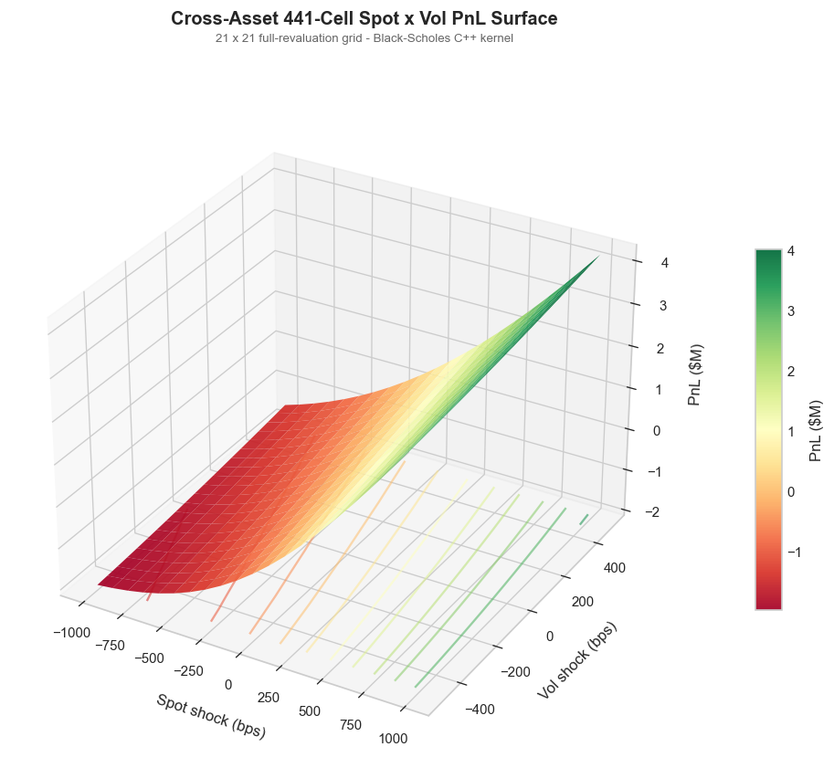

# Cross-Asset Strategic Indices - Calc, Risk & Replication Platform

**Rules-based cross-asset index engine with a 441-cell spot x vol risk ladder, SLSQP hedge frontier, Almgren-Chriss replication, and a C++17 pybind11 Black-Scholes kernel.**

[](https://python.org)
[](https://isocpp.org)
[](https://pybind11.readthedocs.io)
[](https://scipy.org)
[](https://pandas.pydata.org)
[](https://numpy.org)
[](https://matplotlib.org)

[Quick Start](#quick-start) - [Architecture](#architecture) - [Pipeline Walkthrough](#pipeline-walkthrough) - [Data Sources](#data-sources)

</div>

---

## Overview

End-to-end calculation, risk, and algorithmic-replication platform for four rules-based cross-asset indices (SPX vol-target, DV01-neutral 2s/10s rates carry, NYMEX commodity roll-yield, 4-currency G10-subset FX carry) plus a cross-asset 10% vol-target overlay. A unified `Portfolio` object spans equity options, Treasury swap legs, commodity futures, and FX deltas, feeding a bump-and-revalue risk engine that surfaces Greeks, scenarios, a 21 x 21 spot x vol full-revaluation grid, and an SLSQP cost-variance hedge frontier. Algorithmic replication is handled via Almgren-Chriss closed-form sinh trajectories with implementation-shortfall markout decomposition. Equity Greeks run through a header-only C++17 Black-Scholes kernel bound to Python with pybind11.

### Key Capabilities

| Module | What it does |
|--------|-------------|
| **C++ Black-Scholes Kernel** | Header-only C++17 price / delta / gamma / vega / theta + Newton-Raphson implied vol, pybind11-bound |
| **FRED + yfinance Loader** | CSV-cached public-graph FRED + yfinance with offline replay on warm cache |
| **Zero-Curve Bootstrap** | Sequential SOFR/UST bootstrap on DGS deposits + swaps, log-linear interp on ln D(t) |
| **Commodity Curve Proxy** | Realised roll yield over 63-day lookback for CL / HO / RB / NG front generics |
| **FX Forward Curve** | CIP-implied forwards plus per-pair carry from foreign vs USD 3M interbank rates |
| **EQ Vol-Target Rulebook** | SPY 10% ex-ante vol, EWMA lambda=0.94, month-end rebalance with tcost bps |
| **Rates Carry Rulebook** | DV01-neutral 2s/10s, slope-sign signal, 5% vol-scaled weights |
| **Commodity Curve Rulebook** | Equal-weight 4-basket, sign(roll-yield) signal, per-ticker 5% vol-scaled weights |
| **FX Carry Rulebook** | 4-currency G10-subset carry basket on EUR / GBP / JPY / AUD, top-2 minus bottom-2, 8% overlay-vol |
| **Cross-Asset Overlay** | 10% vol-target wrapper across all four legs with leverage cap |
| **Risk Platform** | Greeks sheet + scenarios + 441-cell spot x vol ladder + SLSQP frontier |
| **AC Execution** | Closed-form sinh trajectory, permanent/temporary/timing-risk components |
| **Markout Engine** | Implementation-shortfall decomposition into delay / temporary / permanent / adverse selection |

---

## Quick Start

```bash
# 1. Install dependencies
pip install -r requirements.txt

# 2. Build the C++ pybind11 kernel (optional; Python fallback otherwise)
cmake -S shared/cpp_kernel -B shared/cpp_kernel/build && cmake --build shared/cpp_kernel/build --config Release

# 3. Run the tests
python3 -m pytest -q

# 4. Run the full pipeline
python3 run_full_demo.py
```

Re-generate every figure at any time:

```bash
python3 make_figures.py
```

All artefacts (PNGs + CSVs) land under `outputs/`.

---

## Architecture

```
C++17 header-only (pybind11)             Python 3.9+
+-----------------------------------+    +-----------------------------------------+
| shared/cpp_kernel/                |    | module_a_data/                          |
|   include/black_scholes.h         |    |   loaders.py   (FRED + yfinance + cache)|
|     bs_price / delta / gamma      |    +-----------------------------------------+
|     vega / theta / implied_vol    |    | module_a_curves/                        |
|   bindings/pybind_module.cpp      |--->|   curve_bootstrapper.py (SOFR/UST)      |
|   pricing_kernel.cpython-*.so     |    |   commodity_curve.py    (realised roll) |
+-----------------------------------+    |   fx_forward_curve.py   (CIP forwards)  |
                                         +-----------------------------------------+
Unified API via shared/__init__.py       | module_b_trading/                       |
   bs_price / bs_delta / bs_gamma        |   indices.py  (4 rulebooks + overlay)   |
   bs_vega  / bs_theta / bs_implied_vol  |   calc.py     (IndexCalculator + facts) |
   KERNEL_BACKEND in {cpp, python}       |   risk.py     (Greeks, ladder, SLSQP)   |
                                         +-----------------------------------------+
                                         | module_c_execution/                     |
                                         |   almgren_chriss.py (sinh trajectory)   |
                                         |   markout.py        (IS decomposition)  |
                                         +-----------------------------------------+
                                         | run_full_demo.py  |  make_figures.py    |
                                         +-----------------------------------------+
```

---

## Pipeline Walkthrough

The entire pipeline runs as one script (`run_full_demo.py`), split into eight numbered steps. Each section below includes the relevant math block, figure, and numerical results from a live run over `2022-01-01 -> 2024-06-30`.

### 1 - Data Ingestion

The data layer (`module_a_data/loaders.py`) fetches every macro series from the FRED public-graph CSV endpoint and every tradable instrument from yfinance, with an MD5-keyed CSV cache under `.cache/` so warm runs are fully offline. One-shot ingestion is available via `load_all_inputs(start, end)`.

### 2 - Curves

SOFR/UST zero curve is built by sequential bootstrap: short-end DGS1MO/3MO treated as money-market deposits, long-end DGS2/5/10/30 treated as par swaps, log-linear interpolation on $\ln D(t)$ between nodes.

$$
D(t) = \exp\!\left(-r(t)\, t\right)
$$

$$
S = \frac{1 - D(T)}{\sum_{i} \alpha_i\, D(t_i)}
\qquad
\mathrm{DV01} = \bigl[S(\text{curve} + 1\text{bp}) - S(\text{curve})\bigr] \cdot N
$$

In parallel, `build_commodity_curves` produces the 63-day realised roll-yield series for each NYMEX generic, and `build_fx_forward_panel` produces CIP-implied forwards and per-pair carry $(r_f - r_d)$ for EUR / GBP / JPY / AUD.

<div align="center">
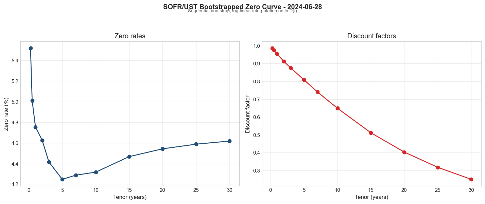

*SOFR/UST zero curve and discount factors for 2024-06-28 (FRED DGS* nodes).*
</div>

<div align="center">
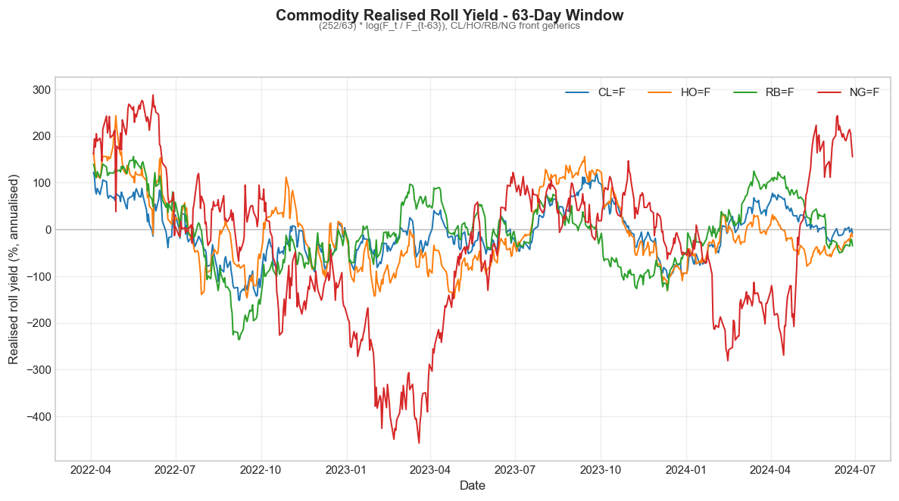

*63-day realised roll yield for CL / HO / RB / NG front generics, 2022-2024.*
</div>

<div align="center">
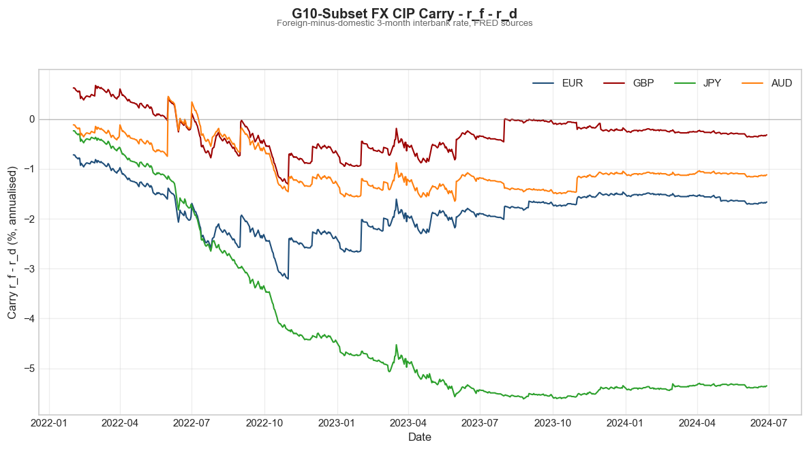

*Per-pair CIP carry $r_f - r_d$ for EUR / GBP / JPY / AUD, 3M interbank basis.*
</div>

### 3 - Index Rulebooks

Four independent rulebooks in `module_b_trading/indices.py` consume the data layer and produce daily `(ret, weight, level)` series. All use month-end rebalance with no look-ahead; the equity leg deducts a `tcost_bps` drag on every turnover event.

**EQ vol-target** - SPY log returns, EWMA variance with $\lambda = 0.94$, leverage clipped to the cap:

$$
\hat{\sigma}_t = \sqrt{252\, \mathrm{EWMA}(r_t^2)}
\qquad
L_t = \mathrm{clip}\!\left(\frac{\sigma_{\text{target}}}{\hat{\sigma}_t},\; 0,\; 1.5\right)
$$

**Rates carry** - sign-of-slope on the 2s/10s curve drives a DV01-weighted portfolio:

$$
\mathrm{signal}_t = \mathrm{sign}(y^{10Y}_t - y^{2Y}_t)
\qquad
r^{\text{carry}}_t = -\mathrm{signal}_{t-1}\cdot\bigl(D_2\,\Delta y^{2Y}_t - D_{10}\,\Delta y^{10Y}_t\bigr)
$$

The sign convention is mean-reversion: when the 2s/10s curve is steep, the signal enters a DV01-neutral flattener stance (long 10Y duration / short 2Y duration).

**Commodity roll-yield** - annualised realised roll over a 63-day lookback on the front generic:

$$
\mathrm{ry}_t = \frac{252}{L}\,\log\!\left(\frac{F_t}{F_{t-L}}\right)
\qquad L = 63
$$

**FX carry (CIP)** - foreign-vs-domestic 3M interbank rates imply a per-pair carry; top-2 minus bottom-2 across EUR / GBP / JPY / AUD:

$$
F(t, T) = S(t)\,\exp\!\bigl((r_d - r_f)\, T\bigr)
\qquad
\mathrm{carry}_t = r_f - r_d
$$

**Cross-asset overlay** - 10% ex-ante vol on the equally weighted sum of the four legs:

$$
r^{\text{port}}_t = \sum_{k\in\{\mathrm{eq,\,rates,\,cmdty,\,fx}\}} r^{(k)}_t
\qquad
L_t = \mathrm{clip}\!\left(\frac{\sigma_{\text{overlay}}}{\hat{\sigma}_{\text{port},t}},\; 0,\; 1.5\right)
$$

<div align="center">
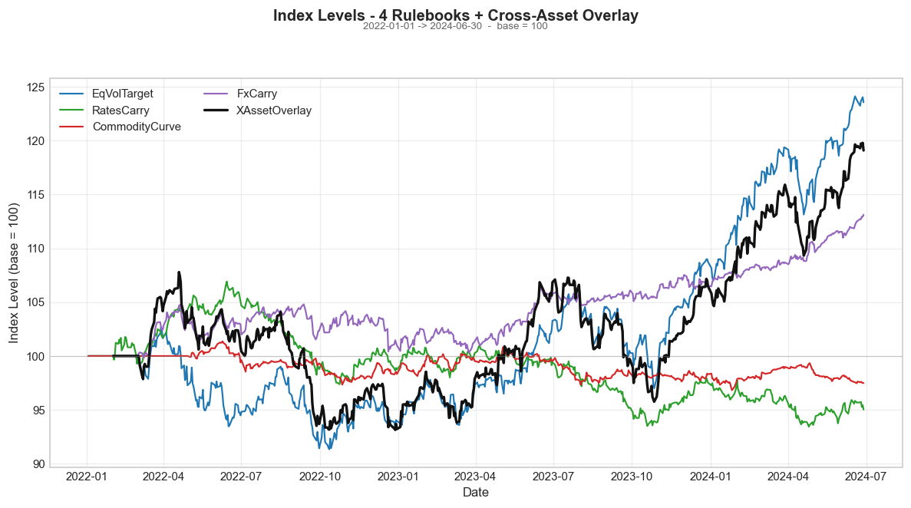

*Daily index levels, base = 100, for the four rulebooks and the cross-asset overlay.*
</div>

<div align="center">
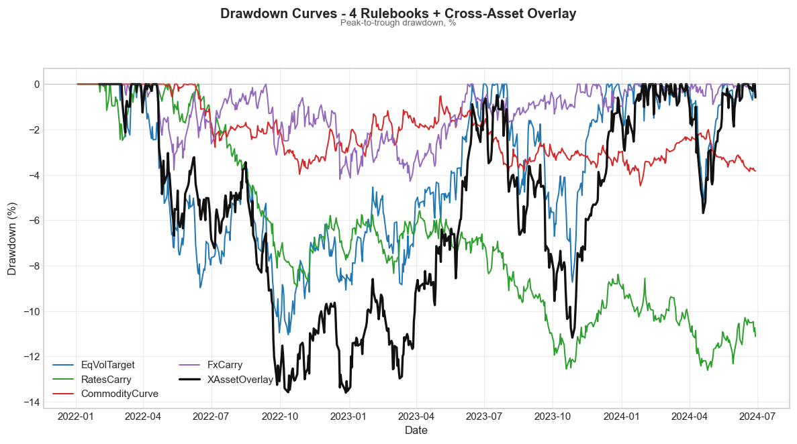

*Peak-to-trough drawdown for each leg and the overlay.*
</div>

### 4 - Calc Engine

`IndexCalculator` runs any rulebook and layers `level = 100 * (1 + r).cumprod()` on top. `FactsheetBuilder.build` produces the standard stats from the resulting frame. The overlay uses a thin adapter so it also flows through the same interface.

| Index            | Level (end) | Ann. return | Ann. vol | Sharpe | Max DD  | Calmar |
|------------------|------------:|------------:|---------:|-------:|--------:|-------:|
| EqVolTarget      | 123.56      | +8.91%      | 9.54%    | +0.93  | -11.04% | +0.81 |
| RatesCarry       |  95.03      | -2.04%      | 5.26%    | -0.39  | -12.61% | -0.16 |
| CommodityCurve   |  97.49      | -1.02%      | 2.87%    | -0.36  | -4.48%  | -0.23 |
| FxCarry          | 113.13      | +5.29%      | 5.00%    | +1.06  | -4.28%  | +1.24 |
| XAssetOverlay    | 119.09      | +7.59%      | 10.11%   | +0.75  | -13.60% | +0.56 |

<div align="center">
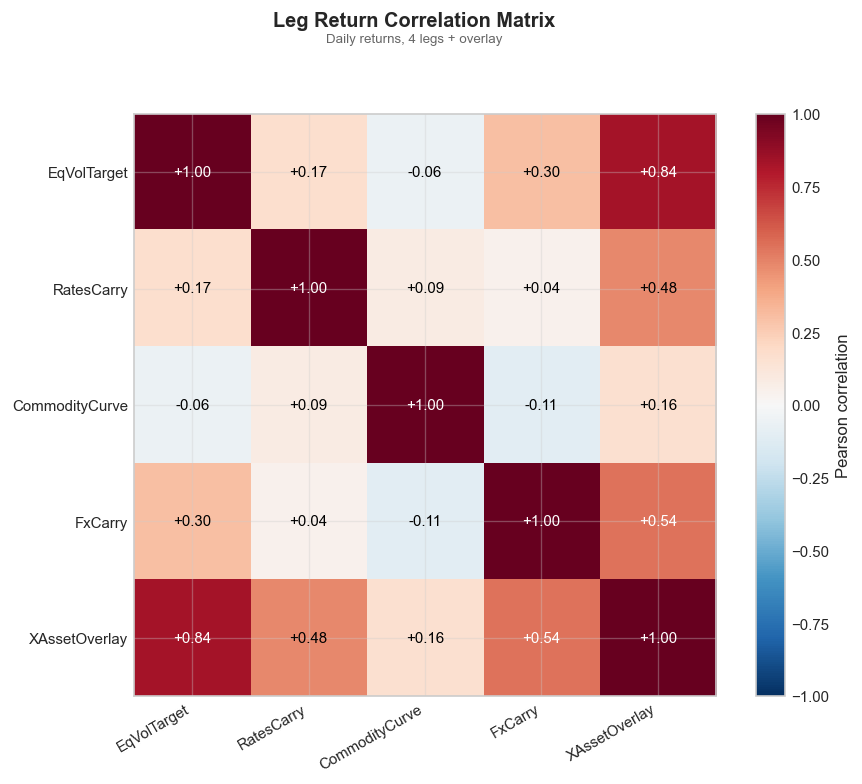

*Pairwise Pearson correlation of daily returns across the four legs and the overlay.*
</div>

<div align="center">
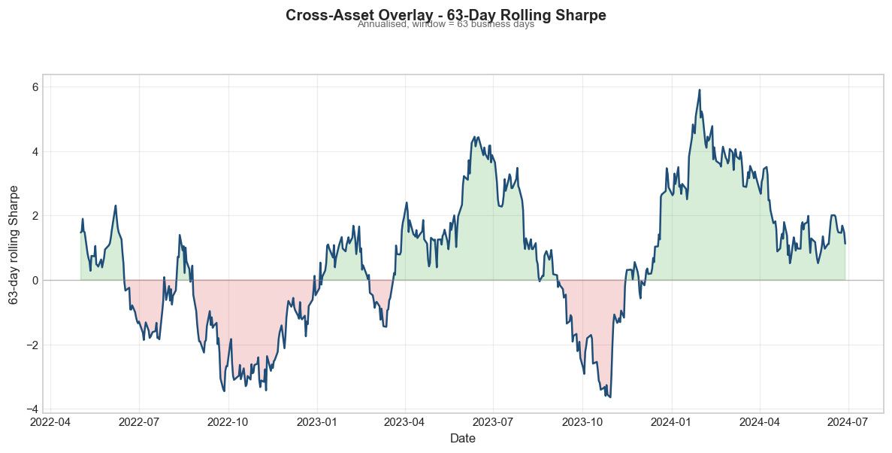

*63-day rolling Sharpe ratio on the cross-asset overlay.*
</div>

### 5 - Risk Platform

A unified `Portfolio` accepts equity options, rates DV01 legs, commodity contracts, and FX deltas. Bump-and-revalue math lives in `module_b_trading/risk.py`; every EQ Greek is computed through the C++ kernel when available.

**Black-Scholes closed forms** (with $q$ = dividend yield, $\tau$ = $T - t$):

$$
d_1 = \frac{\ln(S/K) + (r - q + \tfrac{1}{2}\sigma^2)\tau}{\sigma\sqrt{\tau}}
\qquad
d_2 = d_1 - \sigma\sqrt{\tau}
$$

$$
C = S\,e^{-q\tau}\Phi(d_1) - K\,e^{-r\tau}\Phi(d_2)
\qquad
\Delta^C = e^{-q\tau}\Phi(d_1)
\qquad
\Gamma = \frac{e^{-q\tau}\,\phi(d_1)}{S\,\sigma\sqrt{\tau}}
$$

$$
\mathcal{V} = S\,e^{-q\tau}\,\phi(d_1)\,\sqrt{\tau}
\qquad
\Theta^C = -\frac{S\,e^{-q\tau}\phi(d_1)\sigma}{2\sqrt{\tau}} - r K e^{-r\tau}\Phi(d_2) + q S e^{-q\tau}\Phi(d_1)
$$

**Scenario engine**: each shock is applied through the same revaluation kernel. For EQ legs that means repricing the option; for rates it means parallel-shifting the curve and repricing the swap.

$$
\mathrm{PnL} = V(\text{market} + \text{shock}) - V(\text{market})
$$

**441-cell grid**: 21 spot shifts $\times$ 21 vol shifts, each cell a full BS revaluation.

<div align="center">
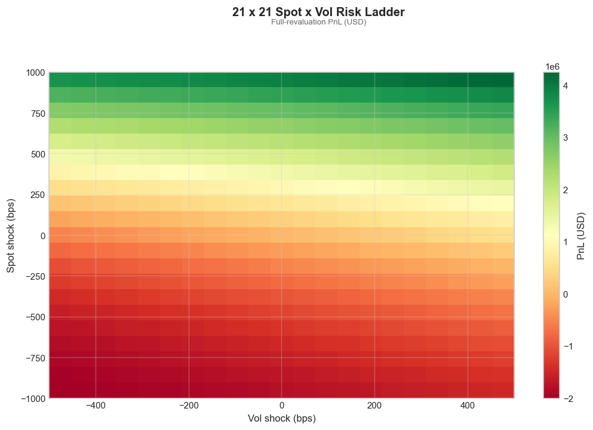

*21 x 21 spot x vol full-revaluation PnL grid (2D projection of the hero surface).*
</div>

### 6 - SLSQP Hedge Frontier

The cost-variance hedger trades off transaction cost against post-hedge variance. The optimiser is `scipy.optimize.minimize(method='SLSQP')` with a smoothed $|x|$ cost term to avoid the kink at zero, warm-started from a closed-form min-variance seed.

$$
\min_{x} \quad \underbrace{\sum_i \sqrt{x_i^2 + \varepsilon^2}\,s_i}_{\text{smoothed cost}}
          + \lambda \cdot \underbrace{\mathrm{Var}\!\left[\mathrm{PnL}(\mathrm{port} + x)\right]}_{\text{residual variance}}
\qquad
\text{s.t.}\quad -M \le x_i \le M
$$

A 12-point $\lambda$ sweep (`logspace(-10, -2, 12)`) traces the efficient frontier.

<div align="center">
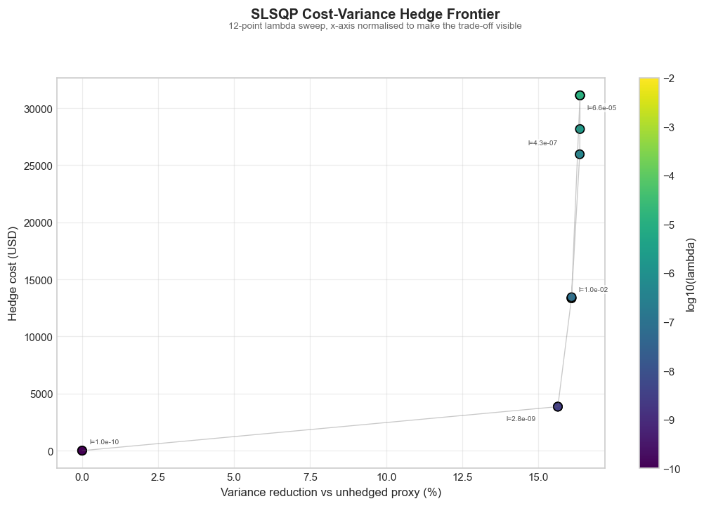

*SLSQP cost-variance frontier colored by $\log_{10}\lambda$, with residual risk shown as variance reduction versus the unhedged proxy.*
</div>

### 7 - Almgren-Chriss Execution

Closed-form sinh trajectory for optimal liquidation of $X$ shares in time $T$ over $N$ slices, given permanent-impact slope $\gamma$, temporary-impact coefficient $\eta$, volatility $\sigma$, and risk aversion $\lambda$:

$$
\kappa = \sqrt{\frac{\lambda\,\sigma^2}{\eta}}
\qquad
x_k = X\,\frac{\sinh\!\bigl(\kappa(T - k\tau)\bigr)}{\sinh(\kappa T)}
\qquad
\tau = \frac{T}{N}
$$

$$
\mathbb{E}[\text{cost}] = \tfrac{1}{2}\gamma X^2 + \varepsilon |X| + \tilde{\eta}\sum_k n_k^2
\qquad
\tilde{\eta} = \eta - \tfrac{1}{2}\gamma\tau
$$

$$
\mathrm{Var}[\text{cost}] = \sigma^2\tau\sum_{k\ge 1} x_k^2
$$

<div align="center">
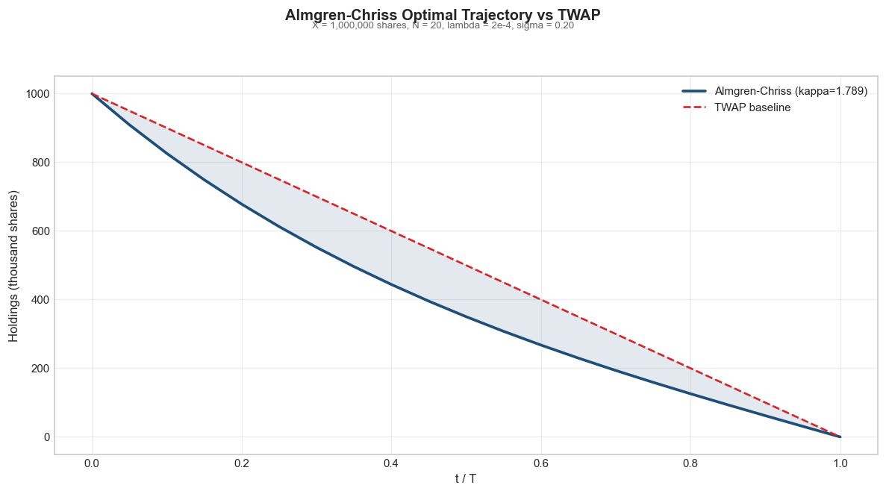

*Optimal sinh trajectory (front-loaded, $\lambda=2\cdot10^{-4}$, $\kappa T \approx 1.79$) vs TWAP baseline. 1,000,000 shares, $T=1$, $N=20$.*
</div>

### 8 - Markout

Implementation-shortfall markout decomposes realised execution cost into four components using decision / arrival / average-exec / end prices.

$$
\text{shortfall}_{\text{bps}} = \frac{(\overline{p}_{\text{exec}} - p_{\text{decision}})\cdot \text{side}}{p_{\text{decision}}}\cdot 10{,}000
$$

$$
\text{total}_{\text{bps}} = \underbrace{\text{delay}}_{\text{decision}\to\text{arrival}}
                         + \underbrace{\text{temporary}}_{\text{arrival}\to\text{avg exec}}
$$

$$
\text{permanent}_{\text{bps}} = \frac{(p_{\text{end}} - p_{\text{arrival}})\cdot \text{side}}{p_{\text{decision}}}\cdot 10{,}000
\qquad
\text{adverse}_{\text{bps}} = \frac{(p_{\text{end}} - \overline{p}_{\text{exec}})\cdot \text{side}}{p_{\text{decision}}}\cdot 10{,}000
$$

Sign convention: positive = adverse to the trader.

<div align="center">
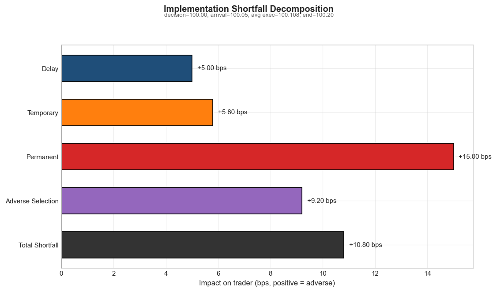

*Implementation-shortfall waterfall: decision = 100.00, arrival = 100.05, avg exec = 100.108, end = 100.20.*
</div>

---

## Summary Dashboard

<div align="center">
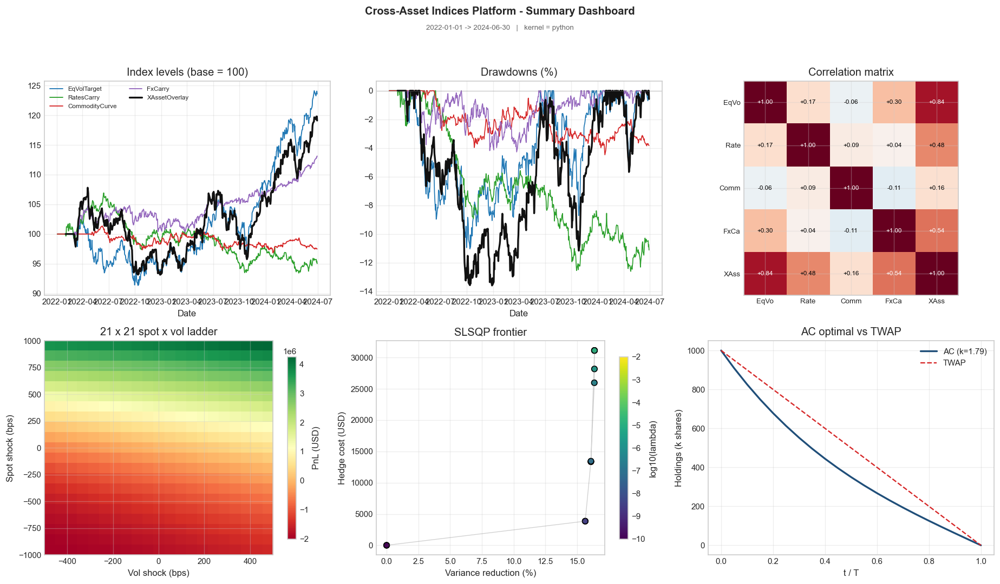
</div>

---

## Data Sources

| Series / Ticker | Source | Role |
|-----------------|--------|------|
| `DGS1MO` / `DGS3MO` | FRED | Short-end deposits for SOFR/UST bootstrap |
| `DGS2` / `DGS5` / `DGS10` / `DGS30` | FRED | Swap nodes + 2s/10s rates carry signal |
| `SOFR` | FRED | Overnight financing rate |
| `VIXCLS` | FRED | Vol regime overlay (context) |
| `DEXUSEU` / `DEXUSUK` / `DEXJPUS` / `DEXUSAL` | FRED | FX spot for 4-currency G10-subset carry basket |
| `IR3TIB01*M156N` | FRED | EUR / GBP / JPY / AUD 3M interbank rates |
| `DCOILWTICO` | FRED | WTI spot for roll-yield cross-check |
| `SPY` / `^GSPC` | yfinance | Equity vol-target underlier |
| `CL=F` / `HO=F` / `RB=F` / `NG=F` | yfinance | NYMEX commodity generics |
| `6E=F` / `6B=F` / `6J=F` / `6A=F` | yfinance | CME FX futures generics |
| `ZT=F` / `ZF=F` / `ZN=F` / `ZB=F` | yfinance | CBOT Treasury futures generics |

All series are cached as CSV under `.cache/` on first download; subsequent runs are offline-instant.

---

## Tech Stack

```
Language        Purpose                             Key libraries
--------------  ----------------------------------  ----------------------------
C++17           Black-Scholes pricer + Greeks       pybind11 (header-only)
Python 3.9+     Orchestration, risk, rulebooks      numpy, pandas, scipy
                Hedge frontier optimisation         scipy.optimize.minimize (SLSQP)
                Data ingestion                      requests (FRED CSV), yfinance
                Visualisation                       matplotlib, seaborn
                Testing                             pytest
```

---

## Tests

```bash
python3 -m pytest -q
```

| Test file | Tests | Coverage |
|-----------|------:|----------|
| `module_a_data/tests/test_loaders.py` | 2 | FRED / yfinance cache round-trip |
| `module_b_trading/tests/test_risk.py` | 6 | Greeks, scenarios, ladder, SLSQP frontier |
| `module_c_execution/tests/test_execution.py` | 3 | AC sinh trajectory, TWAP, markout identity |
| **Total** | **11** | |

---

## Project Structure

```
investible index cross asset/
|-- README.md
|-- PROJECT_SPECS.md            Formal rulebook / math reference
|-- run_full_demo.py            End-to-end pipeline orchestrator
|-- make_figures.py             Regenerates every figure in outputs/
|-- config.py                   RunConfig, FRED_SERIES, tickers, paths
|-- requirements.txt            numpy, pandas, scipy, matplotlib, pybind11, ...
|-- notebook_full_demo.ipynb    Jupyter mirror of the demo
|
|-- module_a_data/
|   `-- loaders.py              FRED CSV + yfinance with MD5-keyed CSV cache
|
|-- module_a_curves/
|   |-- curve_bootstrapper.py   SOFR/UST bootstrap, DiscountCurve, DV01, KR01
|   |-- commodity_curve.py      Realised roll-yield per NYMEX generic
|   `-- fx_forward_curve.py     CIP-implied forwards + carry per pair
|
|-- module_b_trading/
|   |-- indices.py              4 rulebooks + XAssetOverlay
|   |-- calc.py                 IndexCalculator, FactsheetBuilder
|   `-- risk.py                 Portfolio, greeks_sheet, spot_vol_ladder,
|                               scenario_revalue, hedge_frontier (SLSQP)
|
|-- module_c_execution/
|   |-- almgren_chriss.py       Closed-form sinh trajectory + TWAP
|   `-- markout.py              Implementation-shortfall decomposition
|
|-- shared/
|   |-- __init__.py             Unified BS API (C++ preferred, Py fallback)
|   |-- bs_python.py            Reference Black-Scholes in pure Python
|   |-- plot_style.py           set_theme(), suptitle() helpers
|   `-- cpp_kernel/             pybind11 kernel source + compiled .so
|
`-- outputs/                    Generated artefacts
    |-- hero_3d_ladder.png      3D spot x vol PnL surface
    |-- risk_ladder_2d.png      2D heatmap of the same grid
    |-- index_levels.png        Index levels for the 4 legs + overlay
    |-- drawdown_curves.png     Drawdown series per index
    |-- leg_correlation.png     5x5 Pearson correlation matrix
    |-- rolling_sharpe.png      63-day rolling Sharpe on the overlay
    |-- zero_curve.png          SOFR/UST zero rates + DFs (2024-06-28)
    |-- commodity_roll_ts.png   Realised roll yield CL/HO/RB/NG
    |-- fx_carry_ts.png         CIP carry EUR/GBP/JPY/AUD
    |-- slsqp_frontier.png      Cost vs residual-stdev frontier
    |-- execution_schedule.png  AC sinh vs TWAP trajectory
    |-- markout_waterfall.png   IS decomposition bar chart
    |-- summary_dashboard.png   2x3 composite panel
    |-- factsheet.csv           Per-index summary stats
    |-- index_levels.csv        Daily level panel
    `-- markout_table.csv       Markout components
```

---

## References

### Curve Construction & Interpolation

- **Hagan, P. S. & West, G.** (2006). *Interpolation Methods for Curve Construction.* Applied Mathematical Finance, 13(2), 89-129.
- **Fritsch, F. N. & Carlson, R. E.** (1980). *Monotone Piecewise Cubic Interpolation.* SIAM Journal on Numerical Analysis, 17(2), 238-246.
- **Tuckman, B. & Serrat, A.** (2011). *Fixed Income Securities: Tools for Today's Markets.* 3rd ed., Wiley.

### Options Pricing & Greeks

- **Black, F. & Scholes, M.** (1973). *The Pricing of Options and Corporate Liabilities.* Journal of Political Economy, 81(3), 637-654.
- **Gatheral, J.** (2006). *The Volatility Surface: A Practitioner's Guide.* Wiley.

### Carry, Momentum, and Cross-Asset Premia

- **Koijen, R. S. J., Moskowitz, T. J., Pedersen, L. H. & Vrugt, E. B.** (2018). *Carry.* Journal of Financial Economics, 127(2), 197-225.
- **Asness, C. S., Moskowitz, T. J. & Pedersen, L. H.** (2013). *Value and Momentum Everywhere.* Journal of Finance, 68(3), 929-985.
- **Moskowitz, T. J., Ooi, Y. H. & Pedersen, L. H.** (2012). *Time Series Momentum.* Journal of Financial Economics, 104(2), 228-250.
- **Geman, H.** (2005). *Commodities and Commodity Derivatives.* Wiley Finance.

### Execution & Market Impact

- **Almgren, R. & Chriss, N.** (2001). *Optimal Execution of Portfolio Transactions.* Journal of Risk, 3(2), 5-39.
- **Almgren, R.** (2003). *Optimal Execution with Nonlinear Impact Functions and Trading-Enhanced Risk.* Applied Mathematical Finance, 10(1), 1-18.
- **Perold, A. F.** (1988). *The Implementation Shortfall: Paper vs. Reality.* Journal of Portfolio Management, 14(3), 4-9.
- **Kissell, R.** (2013). *The Science of Algorithmic Trading and Portfolio Management.* Academic Press.

### C++ / Python Interop

- **Jakob, W. et al.** *pybind11 - Seamless Operability Between C++11 and Python.* https://pybind11.readthedocs.io

---

<div align="center">

*Open-source cross-asset rulebook + risk engine, implemented in Python and C++17.*

</div>
